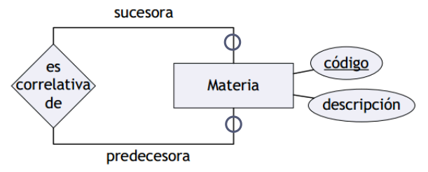

# Modelo Entidad-Relacion (MER)
Herramienta que permite realizar una abstracción o modelo de alguna situación de interés presente en el mundo real.
- Se representa mediante un DER (Diagrama Entidad-Relación).

## Clasificación
- Cardinalidad
    + Uno a uno (one-to-one)
    + Uno a muchos (one-to-many)
    + Muchos a muchos (many-to-many)
- Participación
    + Total
    + Parcial

## Notación
- Database Systems - The complete book (Molina, Ullman, Widon)
    
- Fundamentals of Database Systems (Elmasri, Navathe)
    
- Cátedra (basado en Fundamentals of DB Systems)
    

### Participación parcial
- Fundamentals of Database Systems (Elmasri, Navathe)
    
- Cátedra (basado en Fundamentals of DB Systems)
    

## Roles
Cada entidad que participa en una interrelación, lo hace en un rol particular que ayuda a explicar el significado de la relación.

- **Siempre deben aclararse los roles**.
- En relaciones unarias, siempre debe haber al menos una participación parcial.

## Atributos

## Interrelaciones ternarias
Participan tres entidades a la vez.

- Interpretación
    + "Cada candidato en una compañía puede realizar N entrevistas"
    + "Cada entrevista de un candidato corresponde a una compañía"
    + "Cada entrevista de una compañía corresponde a un candidato"

- Cada entidad participa **siempre** en un elemento de una relación ternaria.
    + Cardinalidad: se define tomando de a dos entidades.
    + Participación: se define individualmente.

## Jerarquías

- Se definen subentidades, que poseen atributos especiales.
- Se utiliza la relación "es un" para indicar subentidad.

### Coberturas
==TODO:==

### Solapamiento
==TODO:==

## Agregación
Abstracción en la cual una interrlación es tratada como una entidad de alto nivel.

## Atributos
- Simple: contiene un valor único
    + Legajo: 1234
    + Apellido: Barrios
    + Nombre: Ezequiel
    + DNI: 5678
- Multivaluado: contiene varios valores
    + Idiomas: {Español, Inglés}

# Modelo Relacional
- Representa la DB como un conjunto de relaciones.
- Intuitivamente, una tabla con filas y columnas.
    + Cada tabla es una relación, y tiene su nombre.
    + Cada columna es un atributo. Se asocia a un dominio (conjunto de valores que puede tomar).
    + Cada fila, denominada tupla, está formada por un conjunto de valores relacionados.

## Definiciones
- Dominio: **D** es un conjunto de valores atómicos.
- Atributo: es el nombre del rol que ejerce algún dominio **D** en un esquema de relación. El dominio de **Aᵢ** se denota **dom(Aᵢ)**.
- Relación: esquema (intención) y extensión (estado o instancia)
    + Esquema: **R**(A₁, A₂, ⋯, Aₙ) consiste en una relación **R** y un conjunto de atributos {A₁, A₂, ⋯, Aₙ}
    + Aridad: cantidad de atributos que tiene.
- Extensión: dado el esquema R(A₁, A₂, ⋯, Aₙ), la extensión **r(R)** = **{t₁, t₂, ⋯, tₘ)**, conjunto de tuplas<Atributo,Valor> con **tᵢ = {<A₁: vᵢ₁}>, <A₂: vᵢ₂>, ⋯, <Aₘ: vᵢₘ>}**.
    + ∀<Aⱼ, vᵢⱼ>, vᵢⱼ ∈ **dom(Aⱼ)**
    + Definición alternativa, **t = {v₁, v₂, ⋯, vₙ}** si consideramos el orden dentro de la tupla.
- La extensión es subconjunto del producto cartesiano de una lista de dominios.
    + r(R) ⊆ (dom(A\_1) × dom(A\_2) × ⋯ × dom(Aₙ))

## Interpretación
- CWA: closed world assumption
    + The closed-world assumption (CWA), in a formal system of logic used for knowledge representation, is the presumption that a statement that is true is also known to be true. Therefore, conversely, what is not currently known to be true, is false. 
    + The opposite of the closed-world assumption is the open-world assumption (OWA), stating that lack of knowledge does not imply falsity.

## Claves
Conjunto minimal de atributos que definen unívocamente a las tuplas.

- Sea K: clave, E: relación, eᵢ eⱼ: tuplas
    + ∀(eᵢ, ejⱼ ∈ E): eᵢ.K = eⱼ.K ⟹ eᵢ = eⱼ
- Varias claves candidatas (CK = Candidate Keys)
- Una clave primaria (PK = Primary Key)
- Referencias a claves de otras relaciones claves externas/foráneas (FK = Foreign Keys)

## Superclaves
==TODO:==

## Restricciones / Constraints
Una **Integrity Constraint** es básicamente una expresión booleana que tiene que evaluar a true.

- Una **relational database schema** S es un conjunto de relaciones {R₁, R₂, ⋯, Rₘ} y un conjunto de integrity constraints IC.
- Un **relational database state** DB of S es un conjunto de estados {r₁, r₂, ⋯, rₘ} tal que rᵢ es una instancia de Rᵢ y que la relación rᵢ satisface los integrity constraints especificados en IC.

- Las restricciones son inherentes al modelo.
- Se expresan en la definición del esquema:
    + Claves
    + Non-NULL
    + Dominios
    + Integridad referencial
    + Integraidad de las relaciones

# Transformación de MER a MR
==TODO:==

# Consideraciones de diseño
==TODO:==