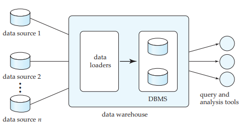

# 10. Data Warehousing

## Business Intelligence
Término genérico que incluye aplicaciones, infraestructura, herramientas y prácticas que permiten el acceso y el análisis de la información para mejorar y optimizar las deciciones y el rendimiento.

## Recursos

### Fuentes de datos
- Data warehouses: almacén de datos estructurado particularmente para su consulta y análisis.
    + Data marts: son pequeños data warehouses que están centrados en un tema específico.

    

    + Subject oriented: son datos orientados a temas específicos.
    + Time-variant: los datos refieren a momentos particulares (snapshots).
    + Non-volatile: siempre **se agregan** datos, no se quitan. Permiten análisis retrospectivos.

    ### Comparación 

    |              | Datos operacionales  | Data Warehouse          |
    | --           | --                   | --                      |
    | Contenido    | Valores elementales  | Datos derivados         |
    | Organización | Por aplicación       | Por tema                |
    | Estabilidad  | Dinámicos            | Estáticos               |
    | Estructura   | Normalizada          | Desnormalizada          |
    | Frec. Acceso | Alta                 | Media a baja            |
    | Tipo acceso  | Lectura/Escritura    | Lectura                 |
    | Uso          | Predecible           | Ad hoc, heurístico      |
    | Tiempo resp. | Segundos             | Segundos a minutos      |
    | #reg p/query | < decenas            | Cientos a miles         |

### Herramientas de administración de datos

==TODO:==

### Herramientas de extracción y consulta

==TODO:==

### Herramientas de modelización (data mining)

==TODO:==